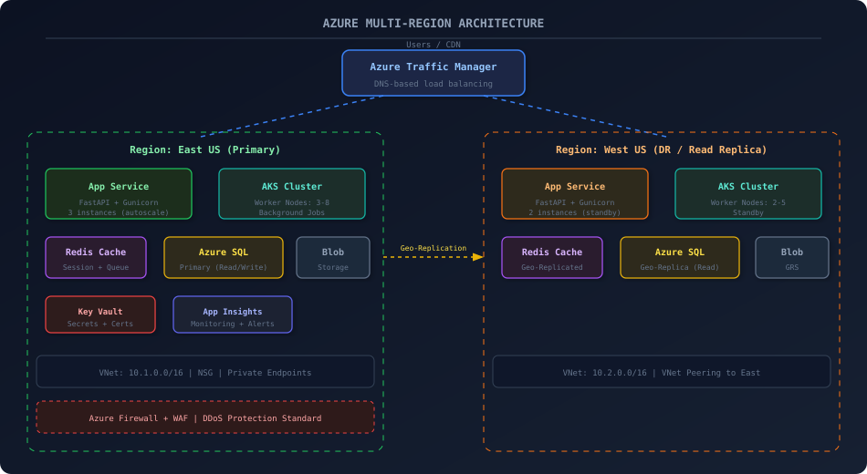

# Designing a Fault-Tolerant Multi-Region Architecture on Azure — What I Learned the Hard Way

After passing AZ-900, I designed a multi-region Azure architecture for a real project. This post covers the architecture decisions, cost traps, networking setup, and the disaster recovery strategy that actually saved us during an outage.

## Architecture

## Background

A few months after getting my AZ-900 certification, I was asked to help design the cloud infrastructure for a project that needed to handle traffic from both US coasts with "five nines of availability." That phrase got thrown around a lot in the requirements doc. I nodded along in the meeting, then went home and calculated what five nines actually means: 5 minutes and 15 seconds of downtime per *year*. For context, a single mistyped `az` CLI command can take you down for longer than that.

This post is about the architecture I designed, the mistakes I made along the way, and the disaster recovery setup that actually saved us during an East US outage about four months in.

## Topics

`Azure` · `Cloud Architecture` · `DevOps` · `Networking` · `Disaster Recovery`

## Repo contents

Artifacts and configs from the build:

- **scripts/** — script.sh, script-2.sh, script-3.sh, script-4.sh, script-5.sh, script-6.sh, script-7.sh

## Read the full write-up

[reshamchaudhary.com/blog/azure-multi-region-architecture](https://reshamchaudhary.com/blog/azure-multi-region-architecture)

The blog post has the full walkthrough — the design decisions, debugging stories, performance numbers, and the lessons that didn't make it into the configs.
